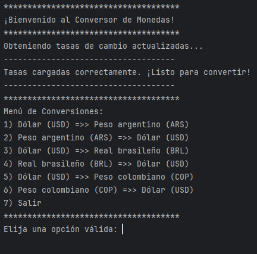
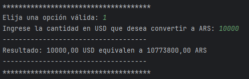

# Conversor de Monedas - Desafío Alura Latam ONE G8

Aplicación de consola en Java que permite convertir valores entre diferentes divisas (ARS, BRL, COP y USD) utilizando tasas de cambio obtenidas en tiempo real desde la API externa [ExchangeRate-API](https://www.exchangerate-api.com/).


## 🚀 Funcionalidades Principales

* **Conexión con API Externa:** Utiliza el cliente HTTP de Java (`java.net.http`) para conectarse a la API de ExchangeRate-API y obtener las tasas de cambio más recientes.
* **Manejo de JSON:** Emplea la biblioteca **Gson** de Google para analizar (parsear) eficientemente la respuesta JSON recibida de la API.
* **Filtrado de Tasas:** Extrae y almacena únicamente las tasas de cambio relevantes para las monedas especificadas en el desafío (ARS, BOB, BRL, CLP, COP, USD), usando USD como base.
* **Cálculo de Conversiones:** Realiza conversiones bidireccionales entre USD y ARS, BRL, COP utilizando las tasas de cambio obtenidas y almacenadas.
* **Interfaz Interactiva:** Presenta un menú de opciones en la consola que permite al usuario:
    * Seleccionar el par de monedas para la conversión.
    * Ingresar la cantidad a convertir.
    * Visualizar el resultado de la conversión formateado.
* **Manejo Básico de Errores:** Valida la entrada del usuario para opciones del menú y cantidades numéricas, mostrando mensajes de error apropiados y permitiendo reintentar.

## 📸 Demostración (Ejemplo)

Aquí puedes ver cómo funciona la aplicación en la consola:

**Ejemplo de Menú:**


------------------------------------------------------
**Ejemplo de Interacción y Resultado:**




## 🛠️ Tecnologías Utilizadas

* **Java:** Versión JDK 21 o superior.
* **`java.net.http.HttpClient`:** Cliente HTTP incorporado en Java (desde Java 11) para realizar las solicitudes a la API.
* **Gson:** Biblioteca de Google (v2.10.1) para la serialización y deserialización de objetos Java a JSON y viceversa.
* **Maven:** Herramienta para la gestión de dependencias del proyecto (específicamente para incluir Gson) y la construcción del proyecto.
* **IntelliJ IDEA Community Edition:** (Opcional) IDE utilizado para el desarrollo.
* **ExchangeRate-API:** Servicio externo que proporciona los datos de tasas de cambio.

## 📝 Proceso de Desarrollo Paso a Paso

Este proyecto se desarrolló siguiendo las fases propuestas en el desafío:

1.  **Fase 1: Configuración del Entorno:** Se verificó la instalación de **JDK 21** y se comprendió la necesidad de la biblioteca **Gson** para el manejo de JSON.
2.  **Fase 2: Creación del Proyecto:** Se configuró un proyecto Java estándar utilizando **Maven** en IntelliJ IDEA. Maven gestiona las bibliotecas externas (dependencias) a través del archivo `pom.xml`.
3.  **Fase 3: Consumo de la API:** Se implementó la lógica para conectarse a la API de ExchangeRate-API utilizando `HttpClient`, `HttpRequest` y `HttpResponse`. Se obtuvo una **API Key** personal y se construyó la URL de solicitud. Se recibió la respuesta cruda del servidor.
4.  **Fase 4: Análisis JSON con Gson:**
    * **¿Qué es Gson?** Es una biblioteca Java de código abierto desarrollada por Google que simplifica la conversión entre objetos Java y su representación JSON. Permite transformar fácilmente la cadena de texto JSON recibida de la API en objetos Java estructurados con los que podemos trabajar.
    * **Importación con Maven:** Para usar Gson, se añadió como dependencia en el archivo `pom.xml` del proyecto. Maven se encarga de descargar la biblioteca automáticamente. La sección relevante en `pom.xml` se ve similar a esto:
        ```xml
        <dependencies>
            <dependency>
                <groupId>com.google.code.gson</groupId>
                <artifactId>gson</artifactId>
                <version>2.10.1</version> </dependency>
        </dependencies>
        ```
    * **Implementación:** Se utilizó `Gson` para parsear `response.body()` (el JSON como String) a un `JsonObject`, permitiendo el acceso estructurado a los datos. Se extrajo el objeto anidado `conversion_rates`.
5.  **Fase 5: Filtro de Monedas:** Se definieron las monedas de interés (ARS, BOB, BRL, CLP, COP, USD). Se iteró sobre estas monedas y se extrajeron sus tasas específicas del `JsonObject` `conversion_rates`, almacenándolas en un `Map<String, Double>` llamado `tasasFiltradas`.
6.  **Fase 9: Conversión de Valores:** Se creó un método reutilizable `convertirMoneda(cantidad, origen, destino, tasas)` que utiliza el mapa `tasasFiltradas`. Este método implementa la lógica de conversión utilizando USD como base común: `resultado = (cantidad / tasaOrigenRespectoUSD) * tasaDestinoRespectoUSD;`. Se añadieron llamadas de ejemplo en `main` para probar la función.
7.  **Fase 10: Interacción con Usuario:** Se implementó la interfaz de usuario final en la consola:
    * Se utilizó `Scanner` para leer la entrada del usuario.
    * Se creó un bucle `while` para mostrar repetidamente un menú con las opciones de conversión (USD <=> ARS, BRL, COP) y la opción de salir.
    * Se usó un `switch` (o `if-else if`) para procesar la opción del usuario.
    * Se solicitó la cantidad a convertir.
    * Se llamó al método `convertirMoneda` con los datos del usuario.
    * Se mostró el resultado formateado en pantalla.
    * Se añadió manejo básico de errores para entradas inválidas.

## ⚙️ Cómo Ejecutar el Proyecto

Sigue estos pasos para ejecutar el conversor en tu máquina local:

1.  **Clonar el repositorio (si aplica):**
    Si el código está en GitHub, clónalo:
    ```bash
    git clone [https://github.com/Delnr91/ConversorDeMonedas.git](https://github.com/Delnr91/ConversorDeMonedas.git)
    cd conversor-monedas
    ```

2.  **Requisito Previo:**
    Asegúrate de tener instalado **Java JDK 21** o una versión superior en tu sistema. Puedes verificarlo ejecutando `java -version` en tu terminal.

3.  **Obtener y Configurar API Key:**
    * **¡MUY IMPORTANTE!** Este proyecto requiere una clave (API Key) para acceder al servicio de tasas de cambio.
    * Regístrate y obtén una clave **gratuita** en [https://www.exchangerate-api.com/](https://www.exchangerate-api.com/).
    * Abre el archivo fuente principal: `src/main/java/com/conversor/Main.java`.
    * Localiza la siguiente línea dentro del método `main`:
        ```java
        String apiKey = "TU_API_KEY"; // O la clave que esté actualmente
        ```
    * **Reemplaza `"TU_API_KEY"`** (o la clave existente) por **tu propia API Key** obtenida de ExchangeRate-API.
    * **Advertencia de Seguridad:** **NO** compartas tu API Key ni la subas a repositorios públicos como GitHub. Si vas a hacer público tu repositorio, considera métodos más seguros para manejar claves (variables de entorno, archivos de configuración externos ignorados por Git) en lugar de incrustarla directamente en el código fuente.

4.  **Ejecución desde IntelliJ IDEA (Recomendado):**
    * Abre el proyecto (`ConversorDeMonedas`) en IntelliJ IDEA.
    * El IDE debería detectar automáticamente que es un proyecto Maven y descargar la dependencia Gson si es necesario.
    * Navega hasta el archivo `Main.java` (ubicado en `src/main/java/com/conversor`).
    * Haz clic derecho dentro del editor de código o sobre el archivo `Main.java` en el panel del proyecto.
    * Selecciona la opción **"Run 'Main.main()'"**.
    * La aplicación se ejecutará en la consola integrada de IntelliJ.

5.  **Ejecución desde la Línea de Comandos (Alternativa):**
    * Necesitas tener **Apache Maven** instalado y configurado en tu sistema. Puedes verificarlo con `mvn -version`.
    * Abre una terminal o línea de comandos.
    * Navega hasta el directorio raíz de tu proyecto (la carpeta que contiene el archivo `pom.xml`).
    * Ejecuta el siguiente comando Maven:
        ```bash
        mvn compile exec:java -Dexec.mainClass="com.conversor.Main"
        ```
    * Maven compilará el proyecto y luego lo ejecutará. Interactuarás con la aplicación directamente en la terminal.

## 👨‍💻 Autor

Desarrollado por **[Daniel Núñez Rojas]**

* **GitHub:** [Enlace a tu perfil de GitHub](https://github.com/delnr91)
* **LinkedIn:** [Enlace a tu perfil de LinkedIn](www.linkedin.com/in/daniel-nuñez-rojas-069573311)
